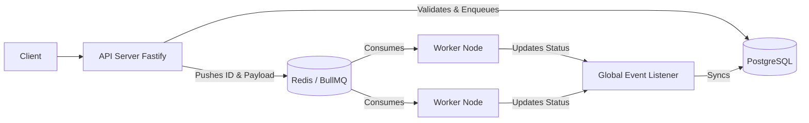
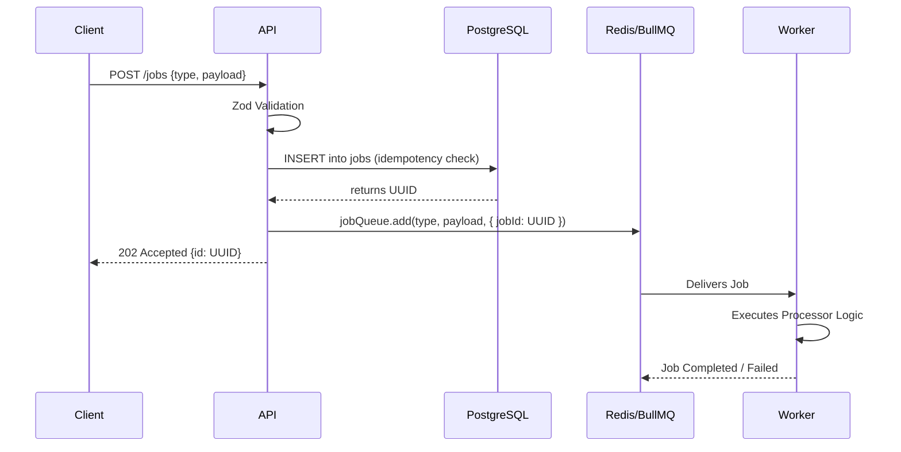
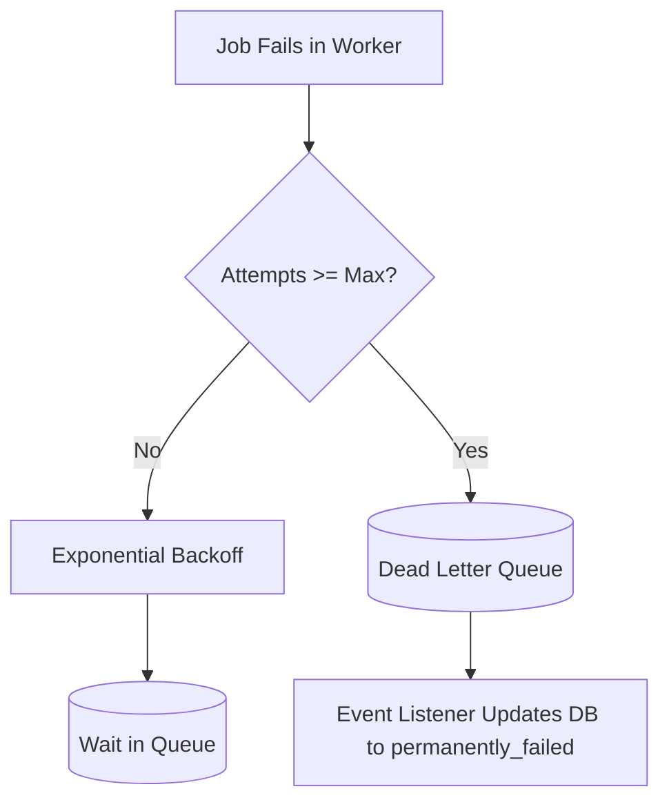

# Distributed Job Queue - Architecture

## 1. System Overview
The Distributed Job Queue is a highly scalable, robust system designed to handle asynchronous tasks. It uses a client-server model where producers push jobs into a queue, and distributed, stateless workers consume and process them.

## 2. System Diagrams

### 2.1 High-Level Architecture


### 2.2 Job Lifecycle Sequence


### 2.3 Failure & DLQ Flow


### 2.4 Scaling Strategy
```mermaid
flowchart TD
    subgraph Web_Tier
        API1[API Server 1]
        API2[API Server 2]
    end
    
    subgraph DB_Tier
        Redis[(Redis Cluster)]
        PG[(PostgreSQL)]
    end
    
    subgraph Worker_Tier
        W1[Worker Node 1 (Concurrency 5)]
        W2[Worker Node 2 (Concurrency 5)]
        W3[Worker Node 3 (Concurrency 5)]
        Wn[Worker Node N...]
    end
    
    Web_Tier --> Redis
    Web_Tier --> PG
    Redis --> Worker_Tier
```

## 4. Service Level Objectives (SLOs)
To maintain the "top 1%" engineering standard, the system adheres to the following performance and reliability targets:

| Metric | SLO Target | measurement |
| :--- | :--- | :--- |
| **Job Processing Latency** | **< 2s (P95)** | Time from 'active' to 'completed' for standard jobs. |
| **Retry Strategy** | **Exponential** | Backoff delays: 1s, 2s, 4s... to protect external services. |
| **Failure Rate** | **< 1%** | Percentage of jobs ending in DLQ vs total enqueued. |
| **System Availability** | **99.9%** | API and Worker uptime monitoring. |

## 5. Advanced Reliability Features

### 5.1 Backpressure Handling
The system protects itself from overwhelming bursts of traffic.
- **Threshold**: If the combined count of `waiting`, `delayed`, and `prioritized` jobs exceeds **10,000**, the API will reject new submissions with a `503 Service Unavailable` response.
- **Goal**: Prevents Redis memory exhaustion and ensures the system remains responsive for status checks even under heavy load.

### 5.2 Reconciliation Logic (Self-Healing)
"DB and Redis may go out of sync" - We fix our own weaknesses.
- **Periodic Sync**: A reconciliation job runs every **5 minutes**.
- **Logic**: It scans PostgreSQL for jobs in `pending` state older than 5 minutes. If a job is missing from Redis, it is automatically re-enqueued.
- **Consistency**: Ensures no job is lost even if the connection to Redis drops between the DB commit and the Redis enqueue.

### 5.3 Distributed Tracing
- **Request ID Propagation**: Every request is assigned a unique `x-request-id`.
- **Visibility**: This ID is propagated into the job metadata and logged by workers, allowing for end-to-end tracing of a single user request through the API into the background processing layer.

## 6. Security (Authentication)
The system is protected via **API Key Authentication** to ensure only authorized producers can submit or monitor jobs.
- **Header**: `x-api-key`
- **Validation**: Requests without a valid key are rejected with a `401 Unauthorized` status and an `AUTH_REQUIRED` error code.
- **Scope**: Applied to all `/jobs` (submission/listing) and `/metrics` endpoints.

## 7. Standardized Error Responses
To ensure production maturity, the system returns structured JSON error responses.

| Error Code | HTTP Status | Description |
| :--- | :--- | :--- |
| `AUTH_REQUIRED` | 401 | Missing or invalid API key. |
| `VALIDATION_FAILED` | 400 | Payload does not match Zod schema. |
| `QUEUE_OVERLOADED` | 503 | Backpressure threshold reached. |
| `IDEMPOTENCY_VIOLATION` | 409 | Job ID already exists (idempotency key conflict). |
| `JOB_NOT_FOUND` | 404 | Requested job ID does not exist in DB. |
| `RATE_LIMIT_EXCEEDED` | 429 | Too many requests from this IP. |

**Example Error Response:**
```json
{
  "error": "QUEUE_OVERLOADED",
  "message": "System under high load. Try again later."
}
```
