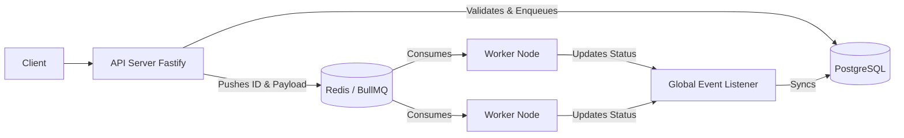
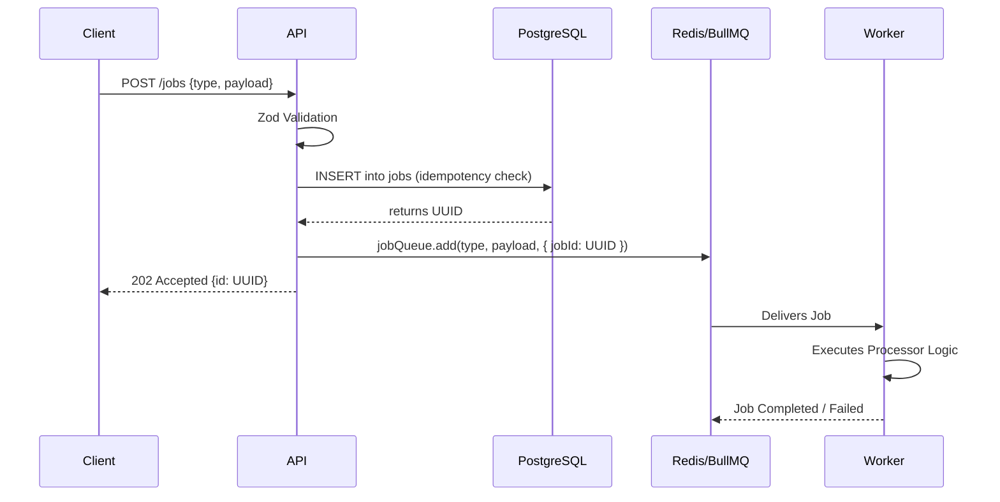
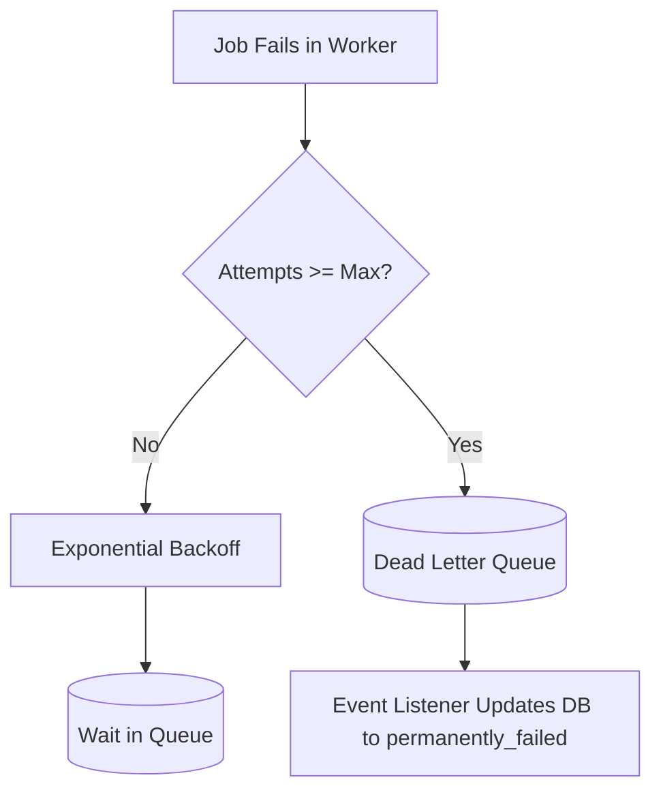

# Distributed Job Queue - Architecture

## 1. System Overview
The Distributed Job Queue is a highly scalable, robust system designed to handle asynchronous tasks. It uses a client-server model where producers push jobs into a queue, and distributed, stateless workers consume and process them.

## 2. System Diagrams

### 2.1 High-Level Architecture


### 2.2 Job Lifecycle Sequence


### 2.3 Failure & DLQ Flow


### 2.4 Scaling Strategy
```mermaid
flowchart TD
    subgraph Web_Tier
        API1[API Server 1]
        API2[API Server 2]
    end
    
    subgraph DB_Tier
        Redis[(Redis Cluster)]
        PG[(PostgreSQL)]
    end
    
    subgraph Worker_Tier
        W1[Worker Node 1 (Concurrency 5)]
        W2[Worker Node 2 (Concurrency 5)]
        W3[Worker Node 3 (Concurrency 5)]
        Wn[Worker Node N...]
    end
    
    Web_Tier --> Redis
    Web_Tier --> PG
    Redis --> Worker_Tier
```

## 3. Tech Stack Justification
- **Express:** Industry standard, highly robust web framework for the API layer. Chosen for widespread familiarity and ecosystem support.
- **BullMQ + Redis:** Industry standard for robust job processing in Node.js. Handles all complex queueing logic natively.
- **PostgreSQL:** Reliable ACID-compliant relational DB for persistent state and auditing.
